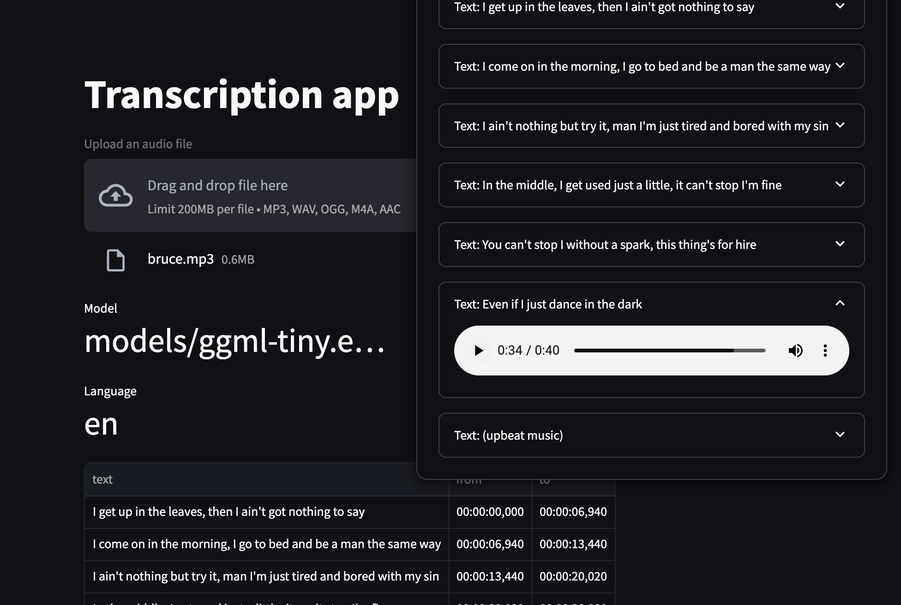

# Transcriber

A utility which uses the [whisper.cpp](https://github.com/ggerganov/whisper.cpp) to transcribe audio files. [I wrote this](https://github.com/charliermarsh/whisper.cpp-cli) literally hours before this was released by @charliemarsh , but it was a fun task to use Pixi to build things from source.

## Getting started

- Install Pixi `curl -fsSL https://pixi.sh/install.sh | bash`
- Set up the whisper model: `pixi run install_whisper` 
  - Downloads and unzips the `whisper.cpp` repo
  - Builds the from source
  - Downloads `tiny.en` model
  - Cleans up
- Run pass an MP3 to the model as WAV: `python -m transcriber  | jq -c`  

## Render the streamlit app:

`streamlit run app.py`

